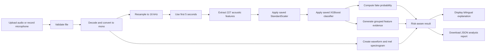

# PROJECT_MAP.md
# KonthoProhori — Bangla Deepfake Audio Detection
## Codex Execution Blueprint for SciBlitz AI Challenge 2026

> **Purpose of this file:** Treat this document as the implementation source of truth.  
> Build the highest-scoring, submission-ready version of the existing Bangla deepfake audio detector without changing or corrupting the trained model assets.
>
> **Recommended competition track:** **Track E — National Defence**
>
> **Submission deadline:** **July 8, 2026, 11:59 PM BST**
>
> **Current repository:**  
> `https://github.com/Enigmah-00/bangla-deepfake-audio-detection`

---

## 1. Executive Product Definition

### 1.1 Recommended project identity

**Primary name:** `KonthoProhori`  
**English descriptor:** `Bangla Deepfake Audio Detection and Voice Forensics`  
**Bangla descriptor:** `বাংলা কণ্ঠস্বর ডিপফেক শনাক্তকরণ ও ফরেনসিক বিশ্লেষণ`

Keep the project name in a single configuration constant so the team can rename it later without editing many files.

### 1.2 One-sentence pitch

KonthoProhori is a privacy-aware Bangla voice-forensics web application that analyzes uploaded or recorded speech, estimates whether it is genuine or AI-generated, visualizes acoustic evidence, and clearly communicates uncertainty for safer human decision-making.

### 1.3 Problem statement

AI-generated speech can imitate public officials, military personnel, journalists, family members, executives, and ordinary citizens. Bangla-speaking communities currently have limited access to locally focused tools for quickly screening suspicious voice clips.

Potential harms include:

- impersonation of public officials or security personnel;
- fabricated emergency announcements;
- election and public-information manipulation;
- financial scams using cloned family or executive voices;
- fake evidence circulated through social media;
- reputational attacks against journalists, institutions, and citizens.

### 1.4 Why Track E is the strongest fit

The project directly supports national security and public-information integrity by helping users screen suspicious Bangla audio before trusting, forwarding, publishing, or acting on it.

The application must be described as a **decision-support and triage system**, not as definitive legal proof.

### 1.5 Core users

1. Journalists and fact-checkers
2. Government communication teams
3. Cybercrime and digital-forensics units
4. Financial institutions and call-center security teams
5. Social-media moderators
6. Ordinary Bangla-speaking citizens

---

## 2. Existing Repository Audit

### 2.1 Existing assets

The repository currently contains:

```text
audio_scaler.joblib
bangla_deepfake_detector.joblib
pipeline.ipynb
```

### 2.2 Existing training pipeline

The notebook currently:

1. downloads the Kaggle dataset `ahanaf101/bangla-deepfake-dataset`;
2. discovers `.wav` files inside `Real` and `Fake` folders;
3. identifies 25,506 audio files:
   - 12,749 real;
   - 12,757 fake;
4. loads up to the first 5 seconds of each clip;
5. resamples audio to 16 kHz;
6. extracts a 227-dimensional handcrafted acoustic feature vector;
7. standardizes the features with `StandardScaler`;
8. trains an `XGBClassifier`;
9. saves the model and scaler as Joblib files.

### 2.3 Exact feature layout

The production inference code must preserve this exact order:

| Index range | Feature family | Dimensions |
|---|---|---:|
| `0:40` | MFCC mean | 40 |
| `40:80` | MFCC standard deviation | 40 |
| `80:92` | Chroma mean | 12 |
| `92:220` | Mel-spectrogram mean | 128 |
| `220:227` | Spectral-contrast mean | 7 |
| **Total** |  | **227** |

Do not reorder, remove, normalize differently, or add features before inference with the existing model.

### 2.4 Existing model configuration

The notebook trains an XGBoost classifier with approximately:

```python
XGBClassifier(
    n_estimators=300,
    max_depth=6,
    learning_rate=0.1,
    subsample=0.8,
    colsample_bytree=0.8,
    random_state=42,
    eval_metric="logloss",
)
```

### 2.5 Existing reported result

The notebook reports:

- accuracy: **99.57%**;
- confusion matrix:

```text
[[2535, 15],
 [   7, 2545]]
```

### 2.6 Critical scientific caution

The reported 99.57% result comes from a random stratified train/test split. It must not automatically be presented as real-world generalization accuracy.

Possible risks include:

- the same speaker appearing in both train and test sets;
- the same recording conditions appearing in both sets;
- generator-specific patterns appearing in both sets;
- dataset artifacts making classification easier;
- performance degradation under compression, background noise, phone calls, or unseen TTS systems.

Use wording such as:

> “The model achieved 99.57% accuracy on the notebook’s held-out random split. Broader cross-speaker, cross-generator, and real-world validation remains future work.”

Never write:

> “The system is 99.57% accurate on all Bangla audio.”

---

## 3. Score-Maximization Strategy

The hackathon scoring weights are:

| Criterion | Weight | Product strategy |
|---|---:|---|
| Innovation & Originality | 25 | Bangla-focused voice forensics, uncertainty handling, interpretable acoustic evidence, bilingual user experience |
| Technical Implementation | 25 | Modular inference system, exact reproducible preprocessing, XGBoost model integration, validation, explainability, tests |
| Real-world Impact & Relevance | 20 | National-security, misinformation, scam, journalism, and public-safety use cases relevant to Bangladesh |
| Demo Quality & Functionality | 20 | Public no-login web app, upload and microphone input, fast results, sample files, graceful errors, downloadable result |
| Presentation & Communication | 10 | Clear README, honest metrics, report, model/data card, polished video and final pitch |

### 3.1 Design target

The project should aim to appear complete in five dimensions:

1. **A real product**, not only a notebook.
2. **A central AI pipeline**, not a decorative API call.
3. **A locally important Bangla problem.**
4. **A working public demonstration.**
5. **Honest and technically defensible communication.**

---

## 4. Non-Negotiable Engineering Rules

Codex must follow these rules:

1. Do not modify the existing Joblib files.
2. Do not retrain the model unless explicitly requested in a separate task.
3. Preserve the exact 227-feature inference pipeline.
4. Load the model and scaler only once per application process.
5. Use relative repository paths, never Colab-specific absolute paths.
6. Pin compatible dependency versions to prevent Joblib loading failures.
7. Reject invalid, empty, silent, corrupt, oversized, or unsupported files gracefully.
8. Do not store user audio after inference.
9. Do not claim the result is legal, forensic, or scientific proof.
10. Do not fabricate dataset licenses, external-test results, user counts, latency, or metrics.
11. Keep the core demo available without login.
12. Add meaningful Git commits. Do not alter commit dates or fabricate history.
13. Ensure all third-party datasets and libraries are attributed.
14. The interface must work on desktop and mobile browsers.
15. The app must never expose a raw Python stack trace to the user.

---

## 5. Recommended Technology and Deployment

### 5.1 Primary implementation

Use:

- **Python 3.12**
- **Gradio**
- **Librosa**
- **SoundFile**
- **NumPy**
- **Scikit-learn**
- **XGBoost**
- **Joblib**
- **Matplotlib**

### 5.2 Why Gradio

Gradio is the fastest reliable path because it provides:

- audio upload;
- microphone recording;
- examples;
- public web UI;
- simple Hugging Face Spaces deployment;
- Python-native model inference;
- minimal frontend/backend integration risk.

### 5.3 Recommended hosting

Deploy to **Hugging Face Spaces** using the Gradio SDK.

The app must:

- be public;
- require no login;
- load the model successfully after a cold start;
- remain usable until at least July 12, 2026;
- be tested again on July 9, 2026;
- include sample audio in case microphone permission is unavailable.

### 5.4 Dependency compatibility

Start with versions matching the notebook environment:

```text
gradio
librosa==0.11.0
soundfile==0.14.0
numpy==2.0.2
scikit-learn==1.6.1
xgboost==3.3.0
joblib==1.5.3
matplotlib
```

If Hugging Face cannot install an exact version, choose the nearest compatible version only after confirming both Joblib files load successfully.

Add a `packages.txt` when needed:

```text
ffmpeg
libsndfile1
```

---

## 6. Target Repository Structure

Refactor the repository into the following structure while preserving the original notebook and assets:

```text
bangla-deepfake-audio-detection/
├── app.py
├── README.md
├── PROJECT_MAP.md
├── requirements.txt
├── packages.txt
├── .gitignore
├── LICENSE
│
├── models/
│   ├── bangla_deepfake_detector.joblib
│   └── audio_scaler.joblib
│
├── src/
│   ├── __init__.py
│   ├── config.py
│   ├── audio_io.py
│   ├── features.py
│   ├── predictor.py
│   ├── explainability.py
│   ├── visualization.py
│   └── reporting.py
│
├── notebooks/
│   └── pipeline.ipynb
│
├── examples/
│   ├── README.md
│   ├── real_sample.wav
│   └── fake_sample.wav
│
├── assets/
│   ├── logo.svg
│   ├── architecture.png
│   ├── confusion_matrix.png
│   └── screenshots/
│
├── artifacts/
│   ├── metrics.json
│   ├── feature_schema.json
│   └── model_metadata.json
│
├── docs/
│   ├── PROJECT_REPORT_SOURCE.md
│   ├── MODEL_DATA_CARD.md
│   ├── DEMO_VIDEO_SCRIPT.md
│   ├── FINAL_PITCH_SCRIPT.md
│   ├── QA_PREPARATION.md
│   └── ATTRIBUTIONS.md
│
├── scripts/
│   ├── smoke_test.py
│   ├── generate_assets.py
│   └── verify_repository.py
│
└── tests/
    ├── test_features.py
    ├── test_predictor.py
    └── test_validation.py
```

### 6.1 Safe file movement

When reorganizing:

- move the notebook to `notebooks/pipeline.ipynb`;
- move the Joblib files to `models/`;
- update all paths;
- preserve Git history using normal `git mv`;
- do not delete the source notebook;
- verify the moved model files have the same hashes before and after movement.

---

## 7. Required Application Flow



---

## 8. P0 Implementation — Must Be Completed First

P0 contains the minimum high-scoring product. Codex should implement these tasks in order.

### P0.1 Repository refactor

- [ ] Create the target folders.
- [ ] Move model files into `models/`.
- [ ] Move notebook into `notebooks/`.
- [ ] Add `.gitignore`.
- [ ] Add `requirements.txt`.
- [ ] Add `packages.txt`.
- [ ] Add a clear code license after confirming the team’s chosen license.
- [ ] Keep dataset and model licensing documented separately.

### P0.2 Central configuration

Create `src/config.py` with:

- project name;
- model paths;
- sample rate: `16000`;
- analysis duration: `5.0`;
- expected feature count: `227`;
- supported file types;
- upload-size limit;
- minimum acceptable duration;
- silence threshold;
- decision thresholds;
- UI text constants.

Use sensible defaults:

```python
SAMPLE_RATE = 16000
ANALYSIS_SECONDS = 5.0
EXPECTED_FEATURE_COUNT = 227
FAKE_THRESHOLD = 0.70
REAL_THRESHOLD = 0.30
MIN_DURATION_SECONDS = 0.50
MAX_UPLOAD_MB = 20
```

The thresholds are product-level uncertainty thresholds, not newly trained thresholds. Clearly label them as heuristic decision bands.

### P0.3 Audio validation and preprocessing

Create `src/audio_io.py`.

Requirements:

- accept Gradio microphone or uploaded-file paths;
- validate file existence and size;
- decode supported audio;
- convert stereo to mono;
- resample to 16 kHz;
- inspect duration;
- reject near-silent audio;
- trim to the first 5 seconds;
- avoid permanent file storage;
- return a structured result or a user-safe validation error.

Suggested supported formats:

```text
.wav, .mp3, .flac, .ogg, .m4a
```

Do not promise support before testing each format in the deployment environment.

### P0.4 Exact feature extraction

Create `src/features.py`.

Use the notebook-equivalent logic:

```python
mfccs = librosa.feature.mfcc(y=audio, sr=16000, n_mfcc=40)
chroma = librosa.feature.chroma_stft(y=audio, sr=16000)
mel = librosa.feature.melspectrogram(y=audio, sr=16000)
contrast = librosa.feature.spectral_contrast(y=audio, sr=16000)

features = np.hstack([
    np.mean(mfccs, axis=1),
    np.std(mfccs, axis=1),
    np.mean(chroma, axis=1),
    np.mean(mel, axis=1),
    np.mean(contrast, axis=1),
])
```

Additional requirements:

- ensure output shape is exactly `(227,)`;
- reject non-finite values;
- return `float32` or a model-compatible numeric dtype;
- do not silently replace failed features with zeros;
- include a function that returns the feature-group index map.

### P0.5 Model loading and prediction

Create `src/predictor.py`.

Requirements:

- load model and scaler through a cached singleton;
- verify each asset exists;
- verify the scaler accepts 227 features;
- calculate `predict_proba`;
- expose `p_fake` and `p_real`;
- apply the three-way product decision:

```text
p_fake >= 0.70  -> Likely Deepfake
p_fake <= 0.30  -> Likely Genuine
otherwise       -> Inconclusive
```

Return structured data similar to:

```python
{
    "label": "Likely Deepfake",
    "label_bn": "সম্ভাব্য ডিপফেক",
    "fake_probability": 0.91,
    "real_probability": 0.09,
    "decision_band": "high-risk",
    "analysis_seconds": 5.0,
    "model_version": "...",
    "disclaimer": "...",
}
```

Use the phrase **model probability** or **model score**, not guaranteed confidence.

### P0.6 Explainability

Create `src/explainability.py`.

Preferred implementation:

- use the XGBoost booster’s contribution output where compatible;
- construct a `DMatrix` from the scaled feature row;
- call `predict(..., pred_contribs=True)`;
- ignore the final bias term when grouping;
- calculate absolute contribution per feature group;
- normalize grouped absolute values to percentages.

Groups:

1. MFCC mean
2. MFCC variability
3. Chroma
4. Mel-spectrum
5. Spectral contrast

Display wording:

> “Relative acoustic evidence used by the model”

Do not claim that a high feature contribution proves manipulation.

Fallback:

- use global XGBoost feature importance;
- label it clearly as global model importance;
- never fabricate local explanations.

### P0.7 Visualizations

Create `src/visualization.py`.

Generate:

1. waveform;
2. log-mel spectrogram;
3. grouped acoustic-evidence bar chart;
4. fake-versus-real probability bar or gauge.

Rules:

- readable on mobile;
- no deceptive red/green-only communication;
- include text labels;
- close Matplotlib figures after rendering;
- handle short or silent signals safely.

### P0.8 Downloadable result

Create `src/reporting.py`.

Allow the user to download a JSON result containing:

- timestamp;
- filename with unsafe path removed;
- duration;
- analyzed duration;
- sample rate;
- predicted label;
- fake probability;
- real probability;
- decision band;
- feature-group evidence;
- model version;
- limitations and disclaimer.

Do not include raw audio or absolute server paths.

### P0.9 Gradio user interface

Create `app.py`.

#### Required UI blocks

1. Project title and one-sentence mission
2. Audio upload
3. Microphone recording
4. Analyze button
5. Sample real and fake audio examples
6. Three-way result card
7. Fake and genuine model probabilities
8. Waveform
9. Mel spectrogram
10. Acoustic evidence chart
11. Download result
12. “How it works” section
13. Intended-use section
14. Limitations and ethics section
15. Dataset/model attribution
16. Bangla and English copy

#### Important UX behavior

- Disable or ignore duplicate analysis while a request is running.
- Show a useful progress state.
- Explain why a file failed.
- Reset old output when a new file is selected.
- Never show stack traces.
- The core demo must require no authentication.
- Include at least one known real and one known fake example.
- Avoid clutter and large paragraphs above the analyzer.

#### Suggested result copy

**Likely Deepfake / সম্ভাব্য ডিপফেক**

> The model found acoustic patterns associated with synthetic or manipulated speech. Verify the clip through its original source before acting or sharing.

**Likely Genuine / সম্ভাব্য আসল কণ্ঠ**

> The model found stronger similarity to genuine speech in its training data. This does not prove authenticity; source verification is still recommended.

**Inconclusive / অনির্ধারিত**

> The model score is not strong enough for a reliable screening decision. Try a clearer clip or request expert review.

#### Required disclaimer

> This tool provides AI-assisted screening, not legal or forensic proof. Performance may vary for unseen speakers, generators, accents, compression levels, background noise, and recording devices.

### P0.10 Tests

Create automated tests.

#### `tests/test_features.py`

- valid generated waveform returns 227 finite values;
- stereo input is converted;
- short valid audio does not crash;
- silence is rejected or clearly flagged;
- corrupt file does not crash the app.

#### `tests/test_predictor.py`

- model and scaler load;
- model accepts one 227-feature row;
- probabilities are between 0 and 1;
- probabilities sum approximately to 1;
- decision-band function behaves correctly at boundaries.

#### `tests/test_validation.py`

- unsupported extension;
- missing file;
- oversized file;
- zero-byte file;
- too-short audio;
- near-silent audio.

### P0.11 Smoke test

Create `scripts/smoke_test.py`.

It must:

1. load both model assets;
2. process example real audio;
3. process example fake audio;
4. print structured outputs;
5. exit non-zero on failure.

### P0.12 README

Create a professional `README.md` with:

1. project overview;
2. problem and Bangladesh relevance;
3. Track E alignment;
4. live demo link;
5. demo video link;
6. screenshots or GIF;
7. architecture diagram;
8. AI pipeline;
9. dataset summary;
10. reported evaluation;
11. honest validation caveat;
12. local installation;
13. deployment instructions;
14. repository structure;
15. privacy and ethics;
16. limitations;
17. future work;
18. team members;
19. third-party attribution;
20. license.

The first screen of the README should immediately show:

```text
Project name
One-sentence value proposition
Live Demo
Demo Video
Track
Main result
Important limitation
```

---

## 9. P1 Enhancements — High Value After P0 Works

Do not begin P1 until the public demo works reliably.

### P1.1 Small external challenge set

Create a small, separately documented test set that was not used in training.

Recommended composition:

- at least 10–20 consented real Bangla clips;
- at least 10–20 generated Bangla clips;
- more than one speaker;
- more than one recording device;
- more than one TTS or voice-cloning source when legally permitted;
- some compressed or noisy examples.

Rules:

- obtain consent for real voices;
- do not publish private voice recordings without consent;
- never add the challenge set to training before reporting its evaluation;
- report its metrics separately from the 99.57% notebook result;
- publish only aggregated metrics if clips cannot be shared.

### P1.2 Robustness checks

Test:

- background noise;
- MP3 compression;
- phone-quality audio;
- low volume;
- music or overlapping speakers;
- clips shorter than 5 seconds;
- clips longer than 5 seconds;
- unseen synthetic generators.

Present the result as a robustness table, not selective success examples.

### P1.3 Speaker-disjoint evaluation

Inspect dataset folder and metadata structure for speaker IDs.

If reliable speaker IDs exist:

- use `GroupShuffleSplit` or `GroupKFold`;
- prevent the same speaker from entering both train and test sets;
- report speaker-disjoint metrics separately;
- do not replace the current model unless the new pipeline is fully verified and produces compatible assets.

### P1.4 Segment-level analysis

For audio longer than 5 seconds:

- split into non-overlapping or lightly overlapping 5-second windows;
- score each window;
- display a suspicious-segment timeline;
- aggregate conservatively;
- label it experimental.

Do not implement this in a rushed way that breaks the existing exact first-5-second pipeline.

### P1.5 Tampering-resistance messaging

Add a short “safe interpretation” panel:

- verify the original sender;
- compare with an official channel;
- avoid forwarding uncertain media;
- request the original uncompressed file;
- escalate high-risk cases for expert review.

---

## 10. Competition Deliverables

The repository must support all required deliverables.

### 10.1 Live public URL

Checklist:

- [ ] public;
- [ ] no login;
- [ ] working microphone or upload;
- [ ] sample files;
- [ ] no stack trace;
- [ ] acceptable cold start;
- [ ] mobile usable;
- [ ] tested from an incognito browser;
- [ ] tested on another device/network;
- [ ] available until at least July 12, 2026.

### 10.2 Project report — maximum 8 pages

Create `docs/PROJECT_REPORT_SOURCE.md`.

Recommended page budget:

| Page | Content |
|---:|---|
| 1 | Title, abstract, problem, Bangladesh/national-security context |
| 2 | Proposed product and user workflow |
| 3 | Dataset and preprocessing |
| 4 | Feature engineering and XGBoost methodology |
| 5 | Architecture and implementation |
| 6 | Results, confusion matrix, demo evidence |
| 7 | Impact, privacy, ethics, deployment |
| 8 | Limitations, future work, references |

Required report sequence:

```text
Problem Statement
Proposed Solution
Methodology
AI/ML Approach
Results
Limitations and Future Work
```

Minimum font size is 10 pt.

### 10.3 Model and Data Card — one page

Create `docs/MODEL_DATA_CARD.md`.

It must include:

#### Dataset

- name;
- source;
- number of files used;
- real/fake distribution;
- audio format;
- known collection limitations;
- license status;
- any uncertainty about the license.

#### Model

- XGBoost binary classifier;
- input: 227 acoustic features;
- preprocessing: mono, 16 kHz, first 5 seconds;
- scaler;
- output;
- saved asset names;
- library versions;
- reported held-out metric.

#### Intended uses

- screening;
- media triage;
- awareness;
- research demonstration.

#### Out-of-scope uses

- criminal conviction;
- automatic censorship;
- biometric identity verification;
- proof of speaker identity;
- unattended high-stakes decisions.

#### Ethical and technical limitations

- false positives and false negatives;
- unseen TTS systems;
- speaker and recording-domain shift;
- compression/noise;
- possible dataset leakage;
- privacy;
- adversarial manipulation.

**License rule:** Inspect the Kaggle dataset page and record the actual license. If the publisher does not specify one, state that clearly. Do not guess.

### 10.4 Demo video — 3 to 5 minutes

Create `docs/DEMO_VIDEO_SCRIPT.md`.

Recommended script:

#### 0:00–0:25 — The problem

Show a suspicious voice-message scenario and explain why Bangla-specific screening matters.

#### 0:25–0:50 — The solution

Introduce KonthoProhori and its intended users.

#### 0:50–1:45 — Genuine-audio demo

Upload or record a clear genuine clip. Show:

- waveform;
- spectrogram;
- result;
- probabilities;
- acoustic evidence;
- disclaimer.

#### 1:45–2:40 — Deepfake-audio demo

Analyze a synthetic clip and explain the result.

#### 2:40–3:20 — Technical pipeline

Show the architecture diagram and explain:

- preprocessing;
- 227 features;
- scaler;
- XGBoost;
- uncertainty band;
- explainability.

#### 3:20–4:00 — Results and honesty

Show the 99.57% held-out result and clearly state the random-split limitation.

#### 4:00–4:30 — Impact and future work

Discuss journalists, cybercrime units, institutions, scams, and robustness validation.

Keep the final video within 3–5 minutes.

### 10.5 Final presentation

Create `docs/FINAL_PITCH_SCRIPT.md`.

The final round allows 5 minutes presentation and 3 minutes Q&A.

Recommended 5-minute flow:

1. 30 sec — high-stakes Bangla voice-deepfake problem
2. 35 sec — target users and national relevance
3. 70 sec — live product demo
4. 55 sec — technical architecture
5. 45 sec — dataset and results
6. 40 sec — privacy, ethics, and limitations
7. 35 sec — roadmap and closing

---

## 11. Judge Q&A Preparation

Create `docs/QA_PREPARATION.md` with strong answers to these questions.

### Q1. Why use handcrafted features and XGBoost instead of a large deep model?

Answer direction:

- efficient inference;
- small model size;
- CPU-friendly deployment;
- interpretable acoustic groups;
- practical for low-resource deployment;
- strong baseline on the available dataset;
- future work includes comparison with wav2vec2 or RawNet-style models.

### Q2. Is 99.57% realistic?

Answer direction:

- it is the notebook’s random held-out split result;
- it is not claimed as universal field accuracy;
- speaker-disjoint and cross-generator validation are important next steps;
- the app includes uncertainty and a clear disclaimer.

### Q3. How is AI central to the project?

Answer direction:

- the product’s main function depends on acoustic feature extraction, learned scaling, and the trained XGBoost classifier;
- visualization and decision logic are built around the model output;
- this is not a wrapper around an external API.

### Q4. Why is this relevant to Bangladesh?

Answer direction:

- Bangla has fewer accessible detection tools;
- Bangla voice messages are widely used;
- manipulated audio can affect public trust, scams, journalism, and national-security communications;
- a lightweight local-language tool lowers the verification barrier.

### Q5. Does the system identify who is speaking?

Answer:

No. It predicts whether acoustic patterns resemble the real or fake classes in its training data. It does not perform speaker identification or identity verification.

### Q6. Can the result be used in court?

Answer:

No. It is an AI-assisted screening tool. Legal or forensic use requires validated chain-of-custody procedures, expert analysis, and stronger external validation.

### Q7. What happens to uploaded audio?

Answer direction:

- processed temporarily;
- not intentionally retained;
- not used for retraining;
- no user account required;
- deployment logs must not capture raw audio paths or content.

### Q8. What is original about the project?

Answer direction:

- Bangla-specific application context;
- locally relevant national-security and misinformation use cases;
- complete deployable workflow;
- acoustic explanation;
- uncertainty-aware bilingual communication;
- privacy-first product design.

---

## 12. Metrics and Evidence Files

Create `artifacts/metrics.json` using only verified notebook results:

```json
{
  "evaluation_type": "random_stratified_holdout",
  "test_size": 5102,
  "accuracy": 0.9957,
  "confusion_matrix": [
    [2535, 15],
    [7, 2545]
  ],
  "real_support": 2550,
  "fake_support": 2552,
  "important_caveat": "Random split; cross-speaker and cross-generator generalization not yet established."
}
```

Create `artifacts/feature_schema.json`:

```json
{
  "sample_rate": 16000,
  "analysis_seconds": 5.0,
  "feature_count": 227,
  "groups": [
    {"name": "mfcc_mean", "start": 0, "end": 40},
    {"name": "mfcc_std", "start": 40, "end": 80},
    {"name": "chroma_mean", "start": 80, "end": 92},
    {"name": "mel_mean", "start": 92, "end": 220},
    {"name": "spectral_contrast_mean", "start": 220, "end": 227}
  ]
}
```

Create `artifacts/model_metadata.json` after loading the actual files:

- file names;
- SHA-256 hashes;
- model class;
- model parameters;
- scaler class;
- input feature count;
- dependency versions;
- generation date if known;
- repository commit hash.

Do not invent unknown metadata.

---

## 13. Privacy, Safety, and Ethical Requirements

### 13.1 Privacy

- Do not save uploaded recordings permanently.
- Do not use uploaded recordings for training.
- Do not expose absolute file paths.
- Remove temporary artifacts after inference where possible.
- Avoid analytics that collect voice content.
- State the privacy behavior in the UI and README.

### 13.2 Responsible interpretation

- Do not call a person a fraudster because a clip scores as fake.
- Do not automatically block or punish users.
- Do not claim speaker identity.
- Do not claim source attribution.
- Do not imply courtroom admissibility.
- Encourage source verification.

### 13.3 Accessibility

- Use bilingual Bangla and English labels.
- Do not communicate only by color.
- Use readable contrast.
- Provide text descriptions for charts.
- Keep the interface usable without technical knowledge.

---

## 14. Git and Commit Strategy

The rulebook requires repository activity during the competition window.

Create several truthful, meaningful commits. Suggested sequence:

```text
chore: organize notebook and trained model assets
feat: add reproducible audio preprocessing and feature extraction
feat: integrate cached XGBoost inference pipeline
feat: build Gradio upload and microphone demo
feat: add acoustic visualizations and grouped explanations
test: add validation, model loading, and inference tests
docs: add README, methodology, limitations, and attribution
docs: add report, model-data card, demo script, and Q&A guide
deploy: configure Hugging Face Spaces public demo
fix: resolve deployment and cold-start issues
```

Rules:

- do not squash everything into one final commit if avoidable;
- do not fabricate old commits;
- do not change Git timestamps;
- each commit should leave the repository in a reasonable state;
- include the live URL in the final README commit.

---

## 15. Deployment Acceptance Tests

Before submission, verify all items.

### 15.1 Model

- [ ] Joblib model loads.
- [ ] Joblib scaler loads.
- [ ] Feature dimension is 227.
- [ ] Real example produces a result.
- [ ] Fake example produces a result.
- [ ] Probabilities are valid.
- [ ] No version warning causes failure.

### 15.2 Input

- [ ] Microphone recording works.
- [ ] WAV upload works.
- [ ] MP3 upload works if advertised.
- [ ] Empty file is rejected.
- [ ] Corrupt file is rejected.
- [ ] Silent file is rejected.
- [ ] Oversized file is rejected.
- [ ] Very short file is handled.

### 15.3 Interface

- [ ] No login required.
- [ ] Mobile view is readable.
- [ ] Result appears without page reload.
- [ ] Old results clear correctly.
- [ ] Downloaded JSON is valid.
- [ ] Limitations are visible.
- [ ] Dataset attribution is visible.
- [ ] No raw exception appears.

### 15.4 Public deployment

- [ ] Opens in incognito mode.
- [ ] Opens from a different network.
- [ ] Survives cold start.
- [ ] Works after a fresh container restart.
- [ ] Public URL is in README.
- [ ] Demo video link is in README.
- [ ] App remains live through required judging dates.

### 15.5 Submission artifacts

- [ ] Public URL
- [ ] Report PDF, maximum 8 pages
- [ ] Public GitHub repository
- [ ] Demo video, 3–5 minutes
- [ ] Model and Data Card, one page
- [ ] All links have correct sharing permissions

---

## 16. Definition of Done

P0 is complete only when:

1. a judge can open the public URL without logging in;
2. the judge can record or upload Bangla audio;
3. the system returns a three-way result without crashing;
4. probabilities, waveform, spectrogram, and acoustic evidence are shown;
5. the result contains a clear limitation statement;
6. model and scaler load from the repository;
7. tests and smoke test pass;
8. README explains the complete project;
9. all third-party resources are attributed;
10. report, video script, final pitch, Q&A, and model/data card sources exist;
11. the live demo has been tested outside the developer machine;
12. no fabricated claim, metric, license, or result exists.

---

## 17. Codex Working Instructions

Execute the project in this order:

```text
1. Inspect the existing repository and verify the three existing files.
2. Create a new implementation branch.
3. Record SHA-256 hashes of the Joblib assets.
4. Refactor the repository using git mv.
5. Implement P0.2 through P0.8 as testable Python modules.
6. Add tests and run them.
7. Build the Gradio UI.
8. Run the smoke test locally.
9. Add README and competition documents.
10. Prepare Hugging Face Spaces configuration.
11. Run repository verification.
12. Report changed files, commands executed, test results, and unresolved external tasks.
```

### Codex must not pause for minor decisions

Use the defaults in this document. Ask for human input only when required for:

- team member names;
- final project name change;
- final live URL;
- final demo-video URL;
- dataset license confirmation when it cannot be found;
- consent status of example recordings;
- deployment account credentials.

### Final Codex response format

After implementation, Codex should return:

```text
IMPLEMENTED
- ...

TEST RESULTS
- ...

DEPLOYMENT STATUS
- ...

HUMAN ACTIONS STILL REQUIRED
- ...

RISKS OR LIMITATIONS
- ...

RECOMMENDED NEXT COMMIT
- ...
```

---

## 18. Optional Score-Boosting Features

Implement only after the core app is stable.

1. suspicious-segment timeline for long audio;
2. offline batch analysis for multiple clips;
3. comparison of original and compressed audio;
4. lightweight REST inference endpoint;
5. bilingual downloadable PDF result;
6. model-card page inside the app;
7. robustness dashboard;
8. external challenge-set evaluation;
9. speaker-disjoint evaluation;
10. comparison with a pretrained speech representation model.

Do not sacrifice deployment reliability for optional features.

---

## 19. Final Product Narrative

Use this narrative consistently across the app, README, report, video, and pitch:

> Bangla voice deepfakes can be used for impersonation, scams, misinformation, and fabricated public announcements. KonthoProhori provides an accessible first-line screening tool for Bangla audio. It combines a trained XGBoost classifier with 227 acoustic features, bilingual explanations, uncertainty-aware decisions, and privacy-conscious processing. The system achieved 99.57% accuracy on the notebook’s random held-out split, while the team explicitly recognizes the need for broader speaker-disjoint, cross-generator, and real-world validation. It is designed to support—not replace—human verification and professional forensic analysis.

---

## 20. Immediate Priority Order

When time is limited, follow this exact order:

### Critical

1. working inference module;
2. working Gradio app;
3. public deployment;
4. graceful error handling;
5. README;
6. live URL validation;
7. demo video.

### High

8. waveform and spectrogram;
9. grouped acoustic explanation;
10. downloadable JSON;
11. report source;
12. one-page model/data card;
13. test suite;
14. screenshots.

### Medium

15. bilingual polishing;
16. external challenge set;
17. robustness table;
18. final-pitch and Q&A refinement.

### Optional

19. segment timeline;
20. REST API;
21. advanced model comparison.

A simple, reliable, honest public demo will score better than a technically ambitious but broken application.
